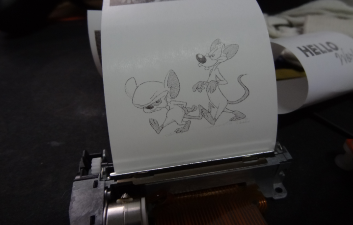

# ThermalPrinterPOC
## _Fun with a FUJITSU printer mechanism and a MSP430G2553_

This is a proof-of-concept to evaluate if a MSP430G2553 is capable of driving a Fujitsu FTP-628MC101 series thermal print engine
## Features

- It prints a simple graphic, 384 pixels by 245 pixels
- It drives the stepper in 1-2 phase excitation mode which leads to smooth motion

## Development and Building
This is a TI Code Composer Studio Project that is run on a MSP430 Launchpad fitted with a MSP430G2553

## How it works
The documentation on this printer mechanism is sketchy at best so allow me to put the record straight.
- The print head, is a large shift register, 384 bits wide which corresponds to the print width.
- 384 bits are clocked in serially, then they are latched to a 384 bit latch via a latch signal
- The 384 bits are arranged into 6 banks. You sequentially power on the banks with the STROBE signals to burn the paper
- You cannot try and be smart and turn all 6 STROBE signals on at once, if you try, the printer head then draws in excess of 3A and will burn either the FFC or the PC board
- Therefore the sequence is as follows
  -- shift 384 pixel bits into the shift register and latch them
  -- wait for the stepper to be in the right position (happens at 2 positions during the stepper cycle -- see code)
  -- sequence the STROBE pins, ensuring each STROBE is on for the same amount of time otherwise print density is uneven
  -- do it all again or stop if the print is completed

## Caveats
- The print head serial transfer is bit banged and incurs some delay in software. This tends to result in a thin gap between adjacent pixel rows on the printed image
- Printing BLACK with high density needs to be done at speed, otherwise the paper sticks to the platen
- Be careful of firmware crashes. If the firmware crashes or hangs while any of the STROBE signals are asserted, the print head WILL burn the paper to a crisp and burn the platen roller

## Usage
1. Program device
2. Release RESET
3. Watch it print
4. Press the user push button on the MSP-EXP430GET evaluation board to feed the paper

## License

This program is published under the terms of the GNU General Public License
